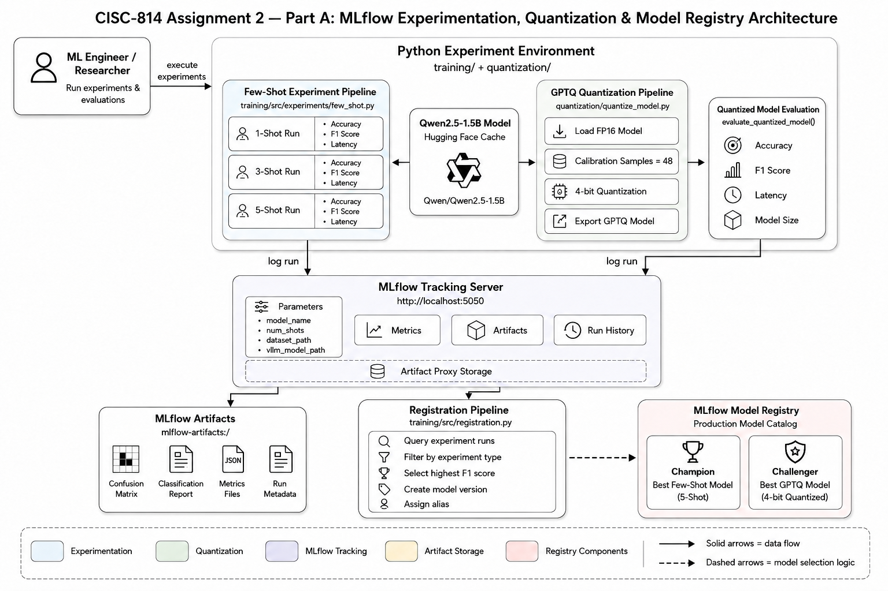
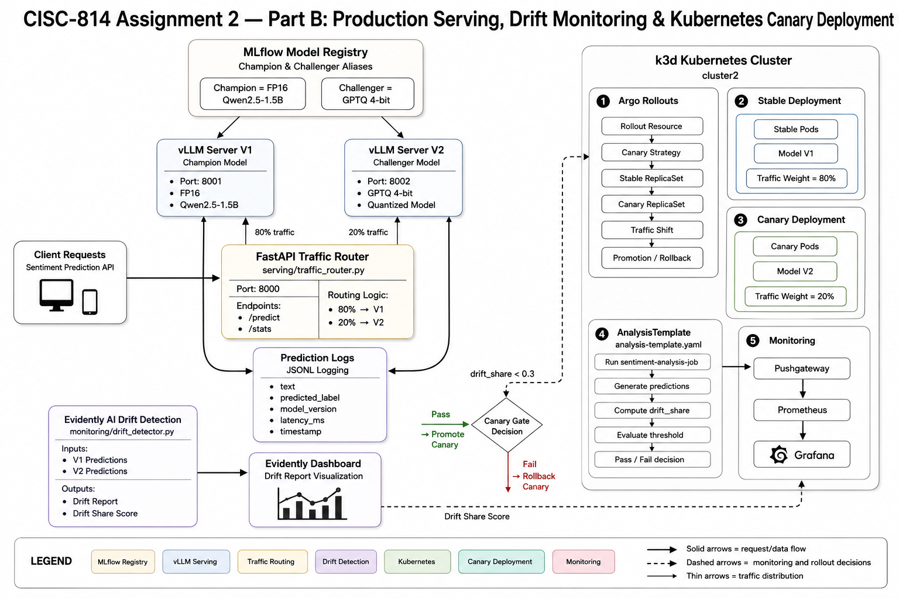

# 🚀 End-to-End MLOps Platform for LLM-Based Sentiment Analysis

> From experiment tracking to drift-aware canary releases on Kubernetes.

This project demonstrates a complete MLOps delivery platform built around large language model (LLM) inference, model lifecycle management, progressive delivery, and production observability.

The platform manages the entire journey of a machine learning model:

**Experiment → Registry → Serving → Validation → Deployment → Monitoring → Promotion**

Using MLflow, vLLM, Kubernetes, Argo Rollouts, Evidently AI, Prometheus, and Grafana, the system enables safe and observable deployment of new model versions while automatically validating their behavior before production promotion.

---

## 📖 Project Overview

Modern ML systems require much more than training a model.

A model must be:

* Evaluated and tracked
* Registered and versioned
* Served efficiently
* Compared against existing versions
* Monitored for behavioral drift
* Released safely
* Observed continuously

This repository implements an end-to-end MLOps workflow around two variants of the same sentiment analysis model:

| Version         | Description                |
| --------------- | -------------------------- |
| V1 (Champion)   | Qwen2.5-1.5B FP16 model    |
| V2 (Challenger) | GPTQ 4-bit quantized model |

The platform continuously validates whether the challenger behaves similarly enough to the champion before allowing promotion into production traffic.

---

# 🏗 Architecture

## Part A — Experimentation & Model Registry



### Responsibilities

* Model experimentation
* Few-shot evaluation
* Quantization benchmarking
* Experiment tracking
* Model registration

### Components

| Component                  | Purpose                            |
| -------------------------- | ---------------------------------- |
| MLflow Tracking Server     | Experiment tracking                |
| MLflow Registry            | Champion/Challenger management     |
| Qwen2.5-1.5B               | Base LLM                           |
| GPTQ Quantization Pipeline | Model optimization                 |
| Evaluation Pipeline        | Accuracy, F1, latency benchmarking |

---

## Part B — Production Platform



### Responsibilities

* Model serving
* Traffic routing
* Drift detection
* Progressive delivery
* Kubernetes deployment
* Monitoring & observability

### Components

| Component              | Purpose                       |
| ---------------------- | ----------------------------- |
| MLflow Registry        | Source of deployment metadata |
| vLLM                   | High-performance inference    |
| FastAPI Router         | A/B traffic distribution      |
| Evidently AI           | Drift analysis                |
| Argo Rollouts          | Progressive delivery          |
| Prometheus             | Metrics collection            |
| Grafana                | Visualization                 |
| k3d Kubernetes Cluster | Runtime environment           |

---

# 🔄 The Journey of a Deployment

The platform is designed around a simple idea:

> Every model change must prove itself before receiving production traffic.

The deployment lifecycle looks like this:

```text
Developer
    │
    ▼
Git Commit
    │
    ▼
CI Pipeline
    │
    ▼
Container Build
    │
    ▼
Container Registry
    │
    ▼
GitOps Repository
    │
    ▼
ArgoCD / Argo Rollouts
    │
    ▼
Kubernetes Cluster
    │
    ▼
Canary Deployment
    │
    ▼
Drift Validation
    │
 ┌──┴──┐
 │     │
Pass  Fail
 │     │
 ▼     ▼
Promote Rollback
```

Rather than blindly replacing an existing model, each new version is treated as a candidate release and evaluated in production-like conditions before promotion.

---

# ⚙️ CI Pipeline

The CI workflow focuses on reproducibility and traceability.

Every experiment run captures:

### Parameters

* Model version
* Dataset path
* Few-shot configuration
* Quantization settings

### Metrics

* Accuracy
* F1 Score
* Inference latency

### Artifacts

* Confusion matrices
* Evaluation reports
* Experiment metadata

All results are stored in MLflow, making every model version fully reproducible.

---

# 📦 Containerization

Containerization ensures that experimentation and production environments remain consistent.

### Serving Containers

Each model is served through:

```text
vLLM OpenAI-Compatible API Server
```

Two independent serving instances are maintained:

| Service | Model           |
| ------- | --------------- |
| V1      | Champion FP16   |
| V2      | Challenger GPTQ |

### Why This Matters

Containerized inference provides:

* Reproducibility
* Environment consistency
* Portable deployments
* Kubernetes compatibility

---

# 🔐 Software Supply Chain & Model Lineage

A production ML system must answer:

> "Which model generated this prediction?"

MLflow acts as the system of record.

Every model version includes:

* Experiment metadata
* Performance metrics
* Registry version
* Deployment alias

Aliases are used to separate deployment intent from implementation details.

| Alias      | Purpose                  |
| ---------- | ------------------------ |
| Champion   | Current production model |
| Challenger | Candidate release        |

This allows deployment automation to reference business intent rather than hardcoded model versions.

---

# 🌱 GitOps Workflow

Deployment state is managed declaratively through Kubernetes manifests.

```text
Git Repository
      │
      ▼
Desired State
      │
      ▼
ArgoCD / Rollouts
      │
      ▼
Cluster Reconciliation
```

Benefits:

* Auditable changes
* Declarative infrastructure
* Repeatable deployments
* Rollback capability
* Version-controlled operations

Infrastructure becomes code rather than manual cluster configuration.

---

# ☸️ Kubernetes Deployment

The production environment runs on Kubernetes using k3d.

Key deployment resources include:

```text
ConfigMap
Service
Rollout
AnalysisTemplate
ServiceMonitor
Grafana Dashboard
```

### Deployment Strategy

The platform deploys a stable model first and introduces new versions incrementally.

Model-specific configuration is externalized through ConfigMaps, allowing releases without rebuilding images.

---

# 🚦 Progressive Delivery & Canary Releases

The most important engineering capability in this project is controlled model promotion.

Instead of replacing V1 immediately, traffic is shifted gradually.

### Rollout Sequence

```text
Stable Deployment (V1)
        │
        ▼
Canary Deployment (V2)
        │
        ▼
Automated Analysis
        │
 ┌──────┴──────┐
 │             │
Pass         Fail
 │             │
 ▼             ▼
Promote      Rollback
```

### Canary Traffic

| Phase   | Stable | Canary |
| ------- | ------ | ------ |
| Initial | 100%   | 0%     |
| Canary  | 80%    | 20%    |
| Promote | 0%     | 100%   |

### Automated Release Gate

Argo Rollouts executes an AnalysisTemplate that:

1. Sends validation requests
2. Compares V1 and V2 predictions
3. Computes drift share
4. Pushes metrics to Prometheus
5. Decides promotion or rollback

No human intervention is required.

---

# 📊 Monitoring & Observability

Observability is built into every stage of the deployment process.

## Metrics Collection

Prometheus collects:

* Inference metrics
* Drift metrics
* Rollout metrics
* Deployment health indicators

---

## Drift Detection

Evidently AI compares:

* Prediction distributions
* Latency distributions
* Label frequencies
* Input characteristics

The system continuously answers:

> "Does the new model behave differently from the current production model?"

---

## Dashboards

Grafana provides visibility into:

* Rollout progress
* Drift scores
* Serving metrics
* System health
* Release decisions

This makes deployment decisions transparent and auditable.

---

# 🛠 Technology Stack

| Category             | Technology            |
| -------------------- | --------------------- |
| Model                | Qwen2.5-1.5B          |
| Quantization         | GPTQ                  |
| Experiment Tracking  | MLflow                |
| Registry             | MLflow Model Registry |
| Inference Serving    | vLLM                  |
| API Layer            | FastAPI               |
| Drift Detection      | Evidently AI          |
| Container Runtime    | Docker                |
| Orchestration        | Kubernetes (k3d)      |
| Progressive Delivery | Argo Rollouts         |
| Monitoring           | Prometheus            |
| Visualization        | Grafana               |

---

# 🧩 Engineering Practices

The platform follows several production engineering principles.

### Reproducibility

Every experiment is versioned and tracked.

### Progressive Delivery

Releases are validated before promotion.

### Observability First

Metrics and drift analysis drive deployment decisions.

### Separation of Concerns

Training, serving, monitoring, and deployment remain independent components.

### Infrastructure as Code

All deployment behavior is defined through Kubernetes manifests.

### Automated Validation

Release safety is enforced through measurable signals rather than manual review.

---

# 📈 Project Outcomes

### Experimentation

* Multiple few-shot configurations evaluated
* Full experiment lineage tracked

### Optimization

* GPTQ quantization reduced model size significantly
* Lower inference latency achieved

### Deployment

* Automated Kubernetes deployment workflow
* Canary rollout strategy implemented

### Reliability

* Drift-aware release validation
* Automatic promotion and rollback capability

### Observability

* End-to-end monitoring pipeline
* Centralized dashboards and metrics

---

# 🎯 Key Takeaways

This project demonstrates how modern MLOps platforms extend far beyond model training.

The real challenge is delivering models safely and repeatedly.

Key capabilities implemented include:

✅ Experiment tracking and lineage

✅ Model registry and version promotion

✅ High-performance LLM serving

✅ A/B testing infrastructure

✅ Drift monitoring

✅ GitOps-driven deployments

✅ Kubernetes-based orchestration

✅ Progressive delivery with automated rollback

✅ End-to-end observability

The result is a production-style MLOps platform where every model release is measurable, observable, and automatically validated before reaching full production traffic.
